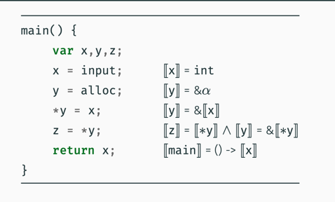
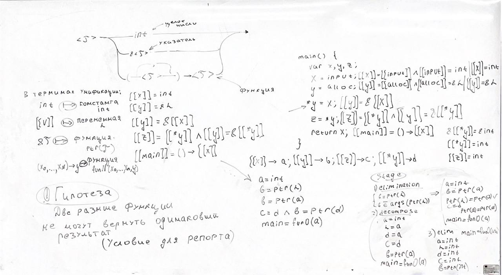
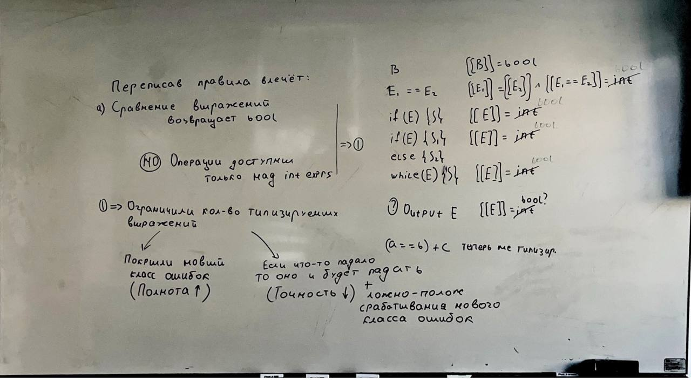
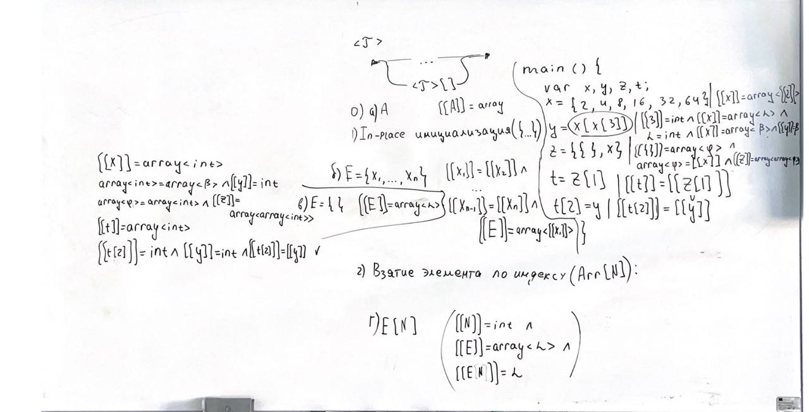

# Попробуйте применить к программе Линейный алгоритм унификации 

### Применил справа снизу 

# Что будет, если в нашу систему ввести тип Bool?
- Попробуйте переписать все правила подходящим образом 
- Будет ли анализ
  - более полным?
  - более точным?

# Что будет, если в нашу систему ввести тип Array?
- Придумайте правила вывода для новых операторов 
- Попробуйте протипизировать программу со слайда

