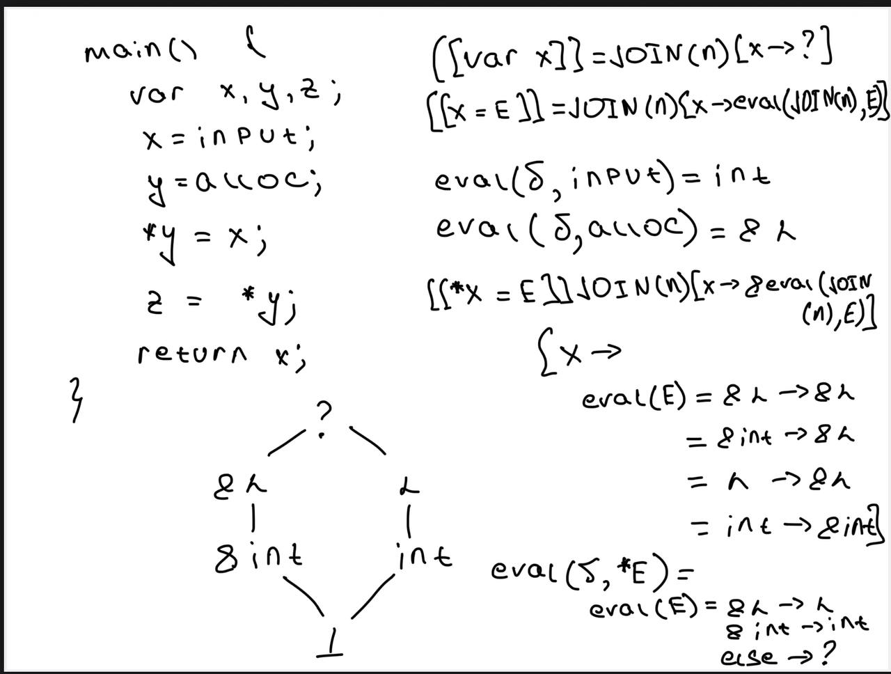

# Можно ли выразить анализ типов с предыдущей лекции как анализ над решетками?
- Если да, то как выглядит наша решетка?
- Если нет, то почему?

Да, как мне кажется надо будет ввести дополнительные правила для:
- Абстрактных вычислений(eval)
- Правила вывода

# Можно ли выразить анализ над решетками как анализ типов?
- Короткий ответ: да, можно(subtyping)
- Длинный ответ: подумайте, всё ли выразимо в таком случае

## Ответ

- В языке может быть **невыразим** всеобщий Top и Bottom
- Могут существовать операторы которые **не монотонны**, но при этом правила type inference позволяют корректно вычислять тип