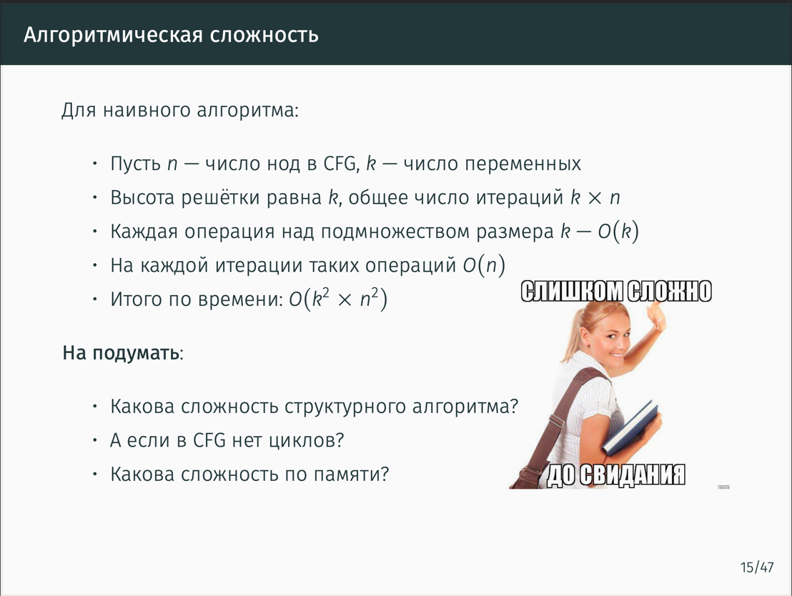

# Какова сложность структурного алгоритма?

Из слайда я подумал так(буду ссылаться на эти мысли):
1) Изначальная сложность O(k x n) взята из посылки что мы **в каждой ноде**
в наивном алгоритме применяем ограничение **к каждой ноде**
2) Еще O(k) добавляет операция над структурой под Lattice (union к примеру)
3) Еще O(n) добавляет факт, что на каждой итерации таких операций n. 
Тут я подумал про лифтинг абстрактных вычислений в зависимые по ограничению ноды CFG.

Структурный алгоритм привязывает порядок применения ограничений к топологии CFG.

В структурном алгоритме избавляемся от прохождения по всем переменным, 
точнее применения ко всем переменным ограничения. Поэтому считаю что уйдет 
одна **k** из (1).

Таким образом считаю что сложность будет O(k x n^2)

# А если в CFG нет циклов?

Могу предположить что (3) как раз нужна в общем случае из-за наличия циклов, 
мы должны лифтить значения в зависимые ноды, чтобы не потерять распространение
значения полученного абстрактным вычислением.

Если циклов не будет, то можно попробовать полифтить значения, полученные
абстрактным вычислением один раз в конце применения eval к нодам cfg и распространить
значение, таким образом убрать O(n).

Таким образом считаю что сложность будет(учитывая структурный алгоритм) O(k x n)

# Какова сложность по памяти?

Исходя из того, что будем хранить в алгоритме Map[cfg -> Lattice.Element]

Lattice.Element всего 2^k(число всех подмножеств), значит будем кодировать его
через k бит.

И таких записей будет n штук, потому что n нод в CFG.

Следовательно, **nk**
