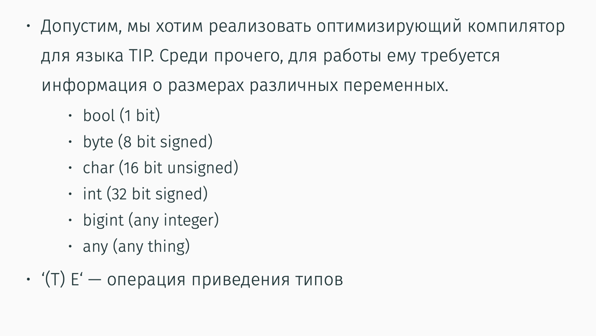
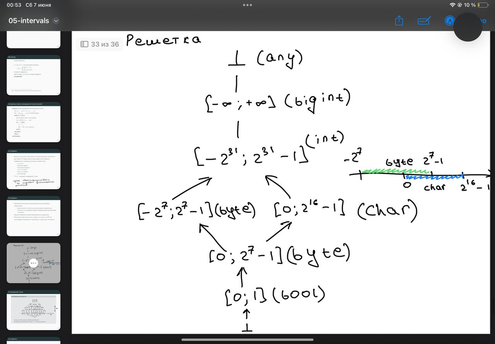
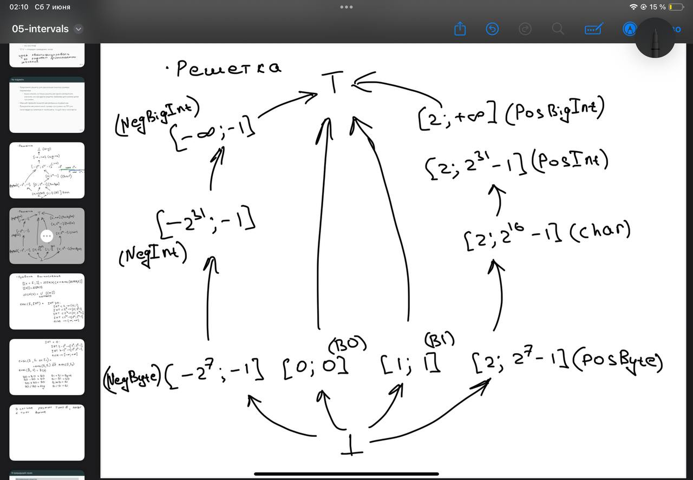

# Предложите решетку для реализации анализа размера переменных

Нужно описать не только решетку для одного абстрактного значения, 
но и все другие решетки, требуемые для анализа целой программы

Немного не понял, зачем нужны другие решетки, я решил попилить значения
по их области определения и прикинул следующую решетку


Но мне она показалась нехорошей с точки зрения реализации lub при операциях
Даже когда я расписывал були я столкнулся с тем, что хочу не улетать в Any
реализуя операцию /. Поэтому хотелось бы 0 вынести в отдельный элемент
решетки, при этом 1 тоже становится отдельным элементом тк иначе мы будем
тратить много места на истинные були, тк они будут скатываться в большие типы.

Далее я пришел к решетке следующего вида


Тут я могу сказать, что она идеальна. С одной стороны она сходима, в ней
гарантируется отношения частичного порядка на операции вхождения интервалов.
Также удобно поделены интервалы чтобы можно было поточнее апроксимировать
операции.

# Опишите правила вычисления различных выражений

Сами операции лучше смотреть в реализации src/tip/lattices/VariableSizeLattice.scala

если вкратце я просто присваиваю перед операцией мин макс значения, затем делаю
операцию, а затем пытаюсь максимально уточнить тип по тем границам, которые получились

# Придумайте пример программы

```
main() {
    var a, b;
    a = 60;      // PosByte
    b = 500;     // CharRange

    while (input) {
        a = 3;       // PosByte
        a = a + 2;   // PosByte (5)
        b = b + 1000; // → CharRange → PosInt → PosBigInt (via widening)
    }

    if (b > 20000) { // [[b > 20000]] = B1 via gt operator in lattice
        b = 1;     // B1
    } else {
        b = b + 5; // widening: still big, stays PosBigInt
    }

    return b; // B1 or PosBigInt
}
```